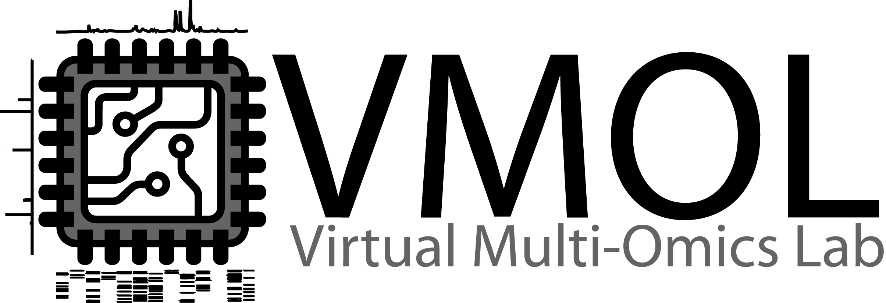

## Mission

The V-MOL, led by Mingxun Wang, Allegra Aron and Daniel Petras aims to connect computational biologists/chemists around the globe in a virtual research group by removing physical and economical barriers of entry to science. The V-MOL provides training in computational mass spectrometry and data science of multi-omics experiments with the goal to launch virtual research projects as a new form of collaborative science. 

## Projects

Here is an abbreviated list of projects that are completed or in progress. Some early stage projects are not listed but if you want to learn about them or join, please come to our meetings. 

| Project Name | People |
| ------------ | ------ |
| Elucidating the Chemistry of La Jolla Stromatolites| Denise Selegato, Jarmo Kalinski, Alexandros Polyzois, Maïa Henry, Allegra Aron |
| Hitchhiker's Guide to Statistical Analysis | Abzer K. Pakkir Shah, Francesco Russo, Filip Ottosson, Axel Walter, Eftychia Eva Kontou, Carolina González-Marín, Marcelo Navarro-Diaz, Shane Farrell, Marie R. Aggerbeck, Judith Boldt, Thapanee Pruksatrakul, Jarmo-Charles J. Kalinski, Alexandros Polyzois, Magdalena Pöchhacker, Martin Hansen, Robin Schmid, Steffen Heuckeroth, Nathan Chan, Mingxun Wang, Allegra Aron, Jan Stanstrup, Madeleine Ernst, Daniel Petras |
| GNPS2 Analysis Workflow Migration | Axel Walter, Alberto Gil de la Fuente, Mingxun Wang |

## Join the Team

Join us at in the [Virtual Lab](contact.md)

## Office Hours

In a virtual laboratory setting, online office hours can a be useful resource for members of the virtual lab to answer questions about their projects within VMOL as well as their own projects. 

Office hours with Prof. Allegra Aron, Prof. Daniel Petras, and Prof. Mingxun Wang will be held at 9AM PST every Tuesday on Zoom. 

[https://ucr.zoom.us/j/98049645231](https://ucr.zoom.us/j/98049645231)

Please sign up on this form just to give us a heads up what you'll be asking about:

<iframe src="https://docs.google.com/forms/d/e/1FAIpQLSeym0Hpah9ZBB3yQuu23PTNHwHPQZhy7akTJcCCA8BbUwoS7A/viewform?embedded=true" width="640" height="606" frameborder="0" marginheight="0" marginwidth="0">Loading…</iframe>
